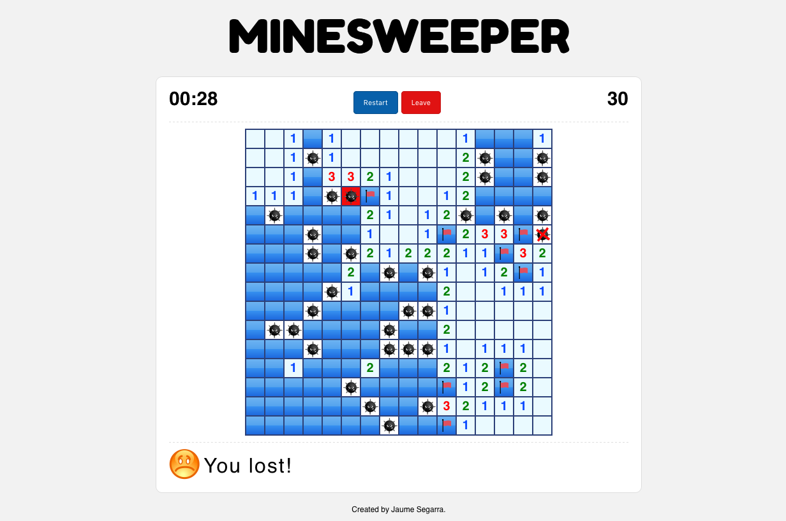

# React Minesweeper 
The minesweeper web game made with react-redux.

Choose your level (Beginner, Professional or Expert) and try win the game. Let play it to your friends and check out the top 10 scores.

## Play online 
Go to [https://jaumesegarra.github.io/minesweeper](https://jaumesegarra.github.io/minesweeper) and ENJOY!

## Develop

In the project directory, you can run:

### `npm run start`

Runs the app in the development mode. 
Open [http://localhost:3000](http://localhost:3000) to view it in the browser.

The page will reload if you make edits. 
You will also see any lint errors in the console.

### `npm run build`

Builds the app for production to the `build` folder. 
It correctly bundles React in production mode and optimizes the build for the best performance.

The build is minified and the filenames include the hashes. 

You should edit `homepage` attribute from `manifest.json` with destination server path before run the command.